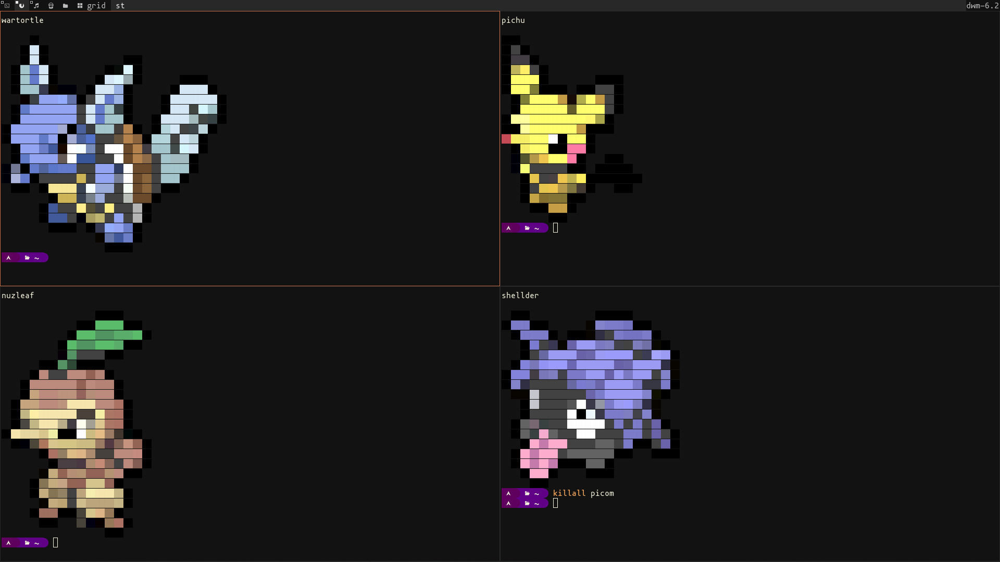

# Pokemon colorscripts

some scripts to print out images of pokemons to terminal. Inspired by 
[DT's colorscripts compilation](https://gitlab.com/dwt1/shell-color-scripts)

## Description
Prints out colored unicode sprites of pokemon onto your terminal. Contains 
almost 900 pokemon from gen 1 to gen 8. Has all the pokemons you could ever want
(okay it doesn't have shiny pokemon or different forms, but cut me some slack)

## Visuals
### Demo GIFs
demo of the program being used


demo of the program running on terminal startup.


### Screenshots




## Requirements
The program itself is just a bash script that prints out custom color formatted 
text files. You will however need a terminal with true color support, which most
modern terminals have. More on terminals and color support can be found in 
[this gist](https://gist.github.com/XVilka/8346728)

## Installation
Download the code from this repository or use git clone
```
git clone https://gitlab.com/phoneybadger/pokemon-colorscripts.git
```
`cd` into the directory and run the install script
```
cd pokemon-colorscripts
sudo ./install.sh
```
now the program should be installed. You can check this by running
```
pokemon-colorscripts
```
which should print out the help page for the program

## Usage
You can run the program from the command line to either display a pokemon of your
choice by specifying the pokemon name or make it display a random pokemon.
```
Usage: pokemon-colorscripts [OPTION] [POKEMON NAME]
  -h, --help, help    	Print this help.
  -l, --list, list    	Print list of all pokemon
  -r, --random, random	Show a random pokemon
  -n, --name          	Select pokemon by name. Generally spelled like in the games.
                        a few exceptions are nidoran-f,nidoran-m,mr-mime,farfetchd,flabebe
                        type-null etc. Perhaps grep the output of --list if in
                        doubt
```

example of printing out a specific pokemon
```
pokemon-colorscripts -n charizard
```
example of printing out a random pokemon
```
pokemon-colorscripts -r
```
Some pokemon with spaces or periods or other special characters in their name
might not be spelled as expected some examples include
```
farfetch'd->farfetchd
mr.mime->mr-mime
```
these are rare exceptions and if required you can parse the `--list` page to see
the names of all the pokemon.

### running on terminal startup
You can display a random pokemon whenever a terminal gets launched by adding
the `pokemon-colorscripts -r` command to your *.bash_profile* or .*zsh_profile*.

### location of the files
The final files for the program are located in opt/pokemon-colorscripts/ with the script
being symlinked to usr/bin/

## How it works
The program itself is a simple bash script that prints out text files corresponding
to the relevant pokemon or a randomly selected pokemon. The textfiles formatted with
appropriate colors can be found in the *colorscripts* folder of the repo. The sprites 
were taken from [pokemondb](https://pokemondb.net/sprites) and were converted into text 
files using a custom python script after some preprocessing. A simple script to
scrape and download all the sprites, and the python script to convert these sprites into properly formatted and colored
text files are also included in the repo and can be found in the *generator_scripts* folder.

## Author
Phoney badger:
https://gitlab.com/phoneybadger
## License
The MIT License (MIT)


